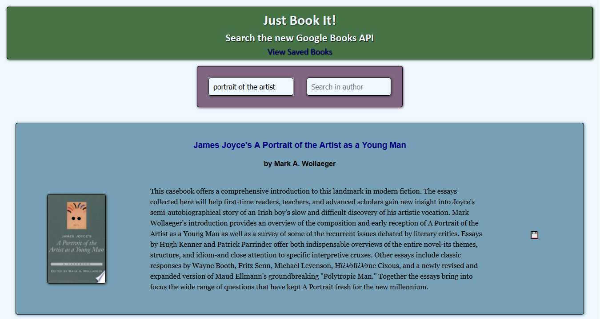
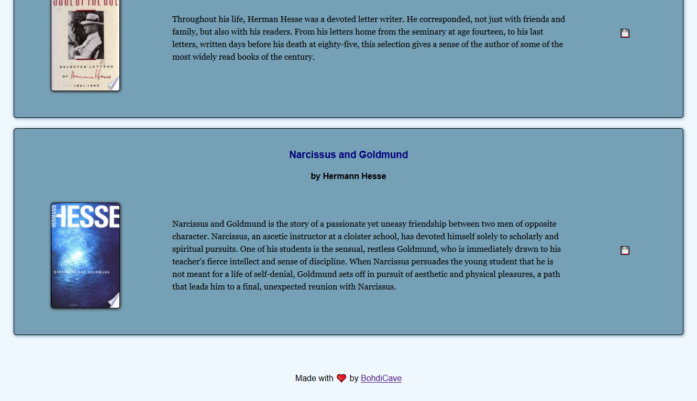

# Just Book It - a full-stack MERN App

This app is a Node/Express/MongoDB/React app deployed to Heroku. It makes a call to Google Books API and allows users to search that API based on the "title" and "author" fields.

In the development phase, the front-end React auto-reloads as it's updated via webpack dev server, and the backend Express app auto-reloads independently with nodemon ("concurrently" dev dependency). Once deployed to Heroku, the app is connected to the GitHub repository and automatically rebuilds the app upon every new push to GitHub.

## Features used

### Frontend

- React components and pages, routed by react-router-dom
- React UseState and UseEffect hooks
- Custom UseDebounce hook - to prevent excessive calls to Google Books API as users input search terms
- Protected API key using .env

### Backend

- MVC architecture
- Client (react app as 'views') and Server (as 'models' and 'controllers' with routes) folder structure
- MongoDB with mongoose.js (deployed on MongoDB Atlas)
- Server falls back to React app if no API routes are hit upon

### Screenshots

